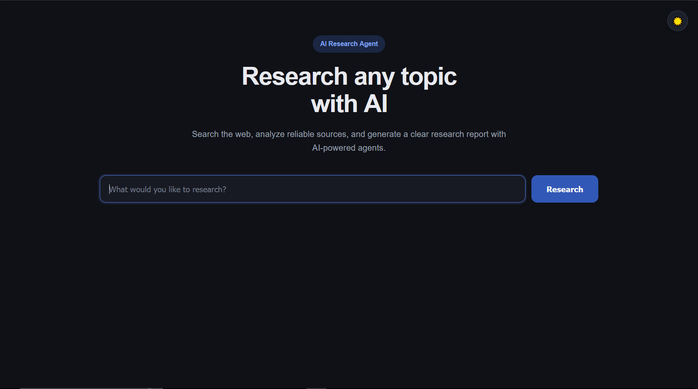
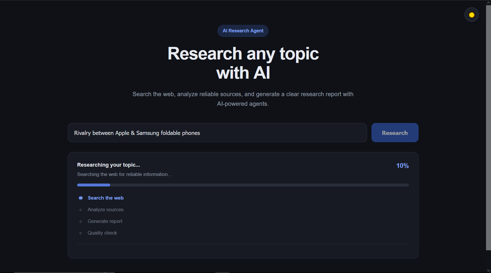
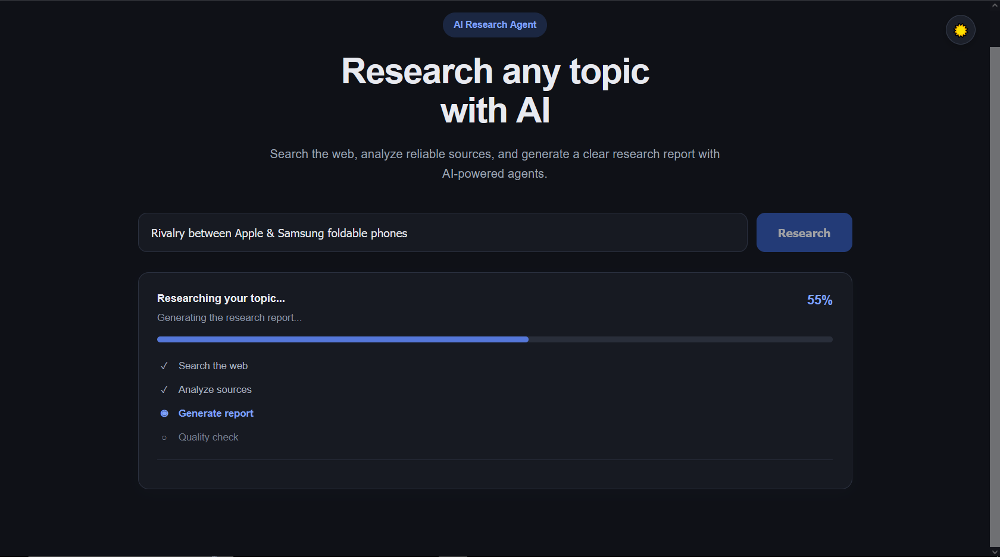
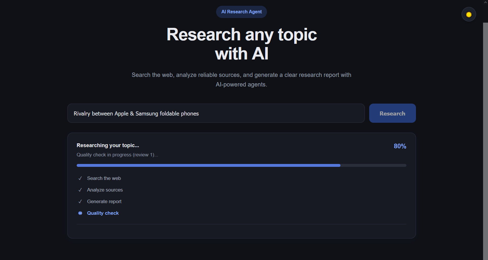
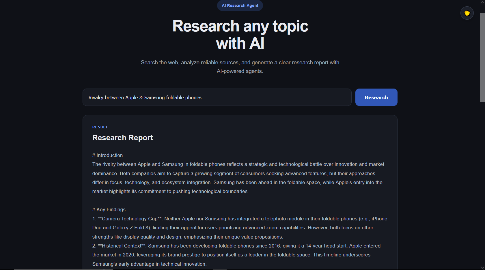
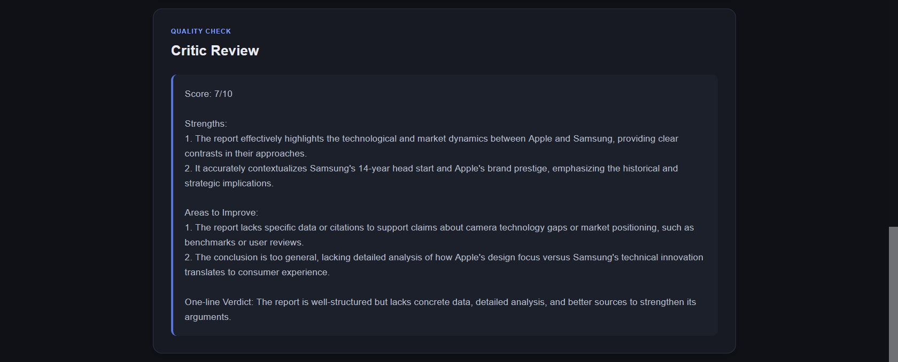

# AI Research Agent

An AI-powered research assistant that searches the web, analyzes information from multiple sources, generates a structured research report, and performs a quality check before presenting the final result.

This project was built as a practical **Generative AI / Agentic AI application**, combining AI agents, external tools, web research, FastAPI, and a lightweight frontend into a complete working application.

## Preview



## Features

- 🔎 **Web Research** — Searches the web for relevant information based on the user's research topic.
- 📚 **Source Analysis** — Processes information gathered from multiple web sources.
- ✍️ **AI Report Generation** — Generates a structured research report based on the gathered information.
- 🧠 **Critic Review** — A separate quality-checking step reviews the generated research.
- 🔄 **Additional Research** — Can perform additional research when the initial result needs improvement.
- 📊 **Live Progress Updates** — Shows the current stage and progress percentage while the system is working.
- 🔗 **Source References** — Displays the sources discovered during the research process.
- 🌙 **Dark Mode** — Includes a light/dark theme toggle with saved user preference.
- 📱 **Responsive Interface** — Designed to work across desktop and smaller screens.
- ⚡ **FastAPI Backend** — Provides the API layer for the research application.
- 🖥️ **Lightweight Frontend** — Built with HTML, CSS, and JavaScript without a heavy frontend framework.


## How It Works

The application follows a multi-stage research workflow:

```text
                    User
                     │
                     ▼
              Research Topic
                     │
                     ▼
              ┌─────────────┐
              │ Web Search  │
              └──────┬──────┘
                     │
                     ▼
            ┌─────────────────┐
            │ Source Analysis │
            └────────┬────────┘
                     │
                     ▼
            ┌─────────────────┐
            │ Report Writer   │
            └────────┬────────┘
                     │
                     ▼
            ┌─────────────────┐
            │  Critic Review  │
            └────────┬────────┘
                     │
              ┌──────┴──────┐
              │             │
           Needs Work?     Good
              │             │
              ▼             ▼
       Additional         Final
        Research          Report
              │             │
              └──────┬──────┘
                     │
                     ▼
              Results + Sources

The frontend receives progress information while the research workflow is running, allowing the user to see which stage is currently being processed.

Application Flow
1. Enter a Topic

The user enters a topic they want to research.

Example:

How is Generative AI changing software development?
2. Search the Web

The research workflow searches for relevant information using an external web search tool.



3. Analyze Sources

The system processes and analyzes information collected from the search results.

4. Generate the Report

The writer component uses the collected information to create a structured research report.



5. Critic Review

The generated report is reviewed by the critic component.

If the result needs improvement, the workflow can perform additional research before producing the final result.



6. Present Results

The application displays:


Research report



Critic feedback



Sources
Research progress
Technology Stack
Backend
Python
FastAPI
Uvicorn
Generative AI
LangChain
AI Agents
Tool Calling
LLM APIs
Research
Tavily Web Search
Frontend
HTML5
CSS3
JavaScript
Server-Sent Events (SSE)
Development
VS Code
Python Virtual Environment
Git / GitHub
Project Structure
AI Research Agent/
│
├── main.py
├── pipeline.py
├── agents.py
├── tools.py
│
├── frontend/
│   ├── index.html
│   ├── script.js
│   └── style.css
│
├── assets/
│   └── Researcher.PNG
│
├── requirements.txt
├── .env
├── .gitignore
└── README.md
Main Components
main.py

Handles the FastAPI application and API endpoints.

pipeline.py

Contains the main research workflow and coordinates the different stages of the research process.

agents.py

Contains the AI agents and chains responsible for tasks such as searching, analyzing, writing, and critic review.

tools.py

Contains external tools used by the AI workflow, including web search functionality.

frontend/

Contains the user interface:

index.html — Application structure
style.css — Interface styling and dark mode
script.js — Research requests, progress updates, results, and theme switching
API
Health Check
GET /health

Example response:

{
  "status": "healthy"
}
Research
POST /api/research

Request:

{
  "topic": "Impact of artificial intelligence on software development"
}

The endpoint processes the research topic through the AI research workflow and returns the generated report, critic feedback, and sources.

Running Locally
1. Clone the Repository
git clone https://github.com/realdawood/AI-Research-Agent.git
cd AI-Research-Agent

If your GitHub repository has a different name, replace the repository URL and folder name accordingly.

2. Create a Virtual Environment

On Windows:

python -m venv .venv

Activate using Command Prompt:

.venv\Scripts\activate

Or Git Bash:

source .venv/Scripts/activate
3. Install Dependencies
pip install -r requirements.txt
4. Configure Environment Variables

Create a .env file in the project root.

Add the API credentials required by the project, for example:

TAVILY_API_KEY=your_tavily_api_key

Add the required LLM provider credentials according to the model configuration in agents.py.

Never commit your .env file or API keys to GitHub.

5. Start the Application
uvicorn main:app --reload

The application will be available at:

http://127.0.0.1:8000

Open the address in your browser.

Example

Enter a research topic such as:

The future of Generative AI in software development

The application will process the topic through the research workflow and display the results.

The interface provides live feedback while the research is being performed.

What I Built

This project was created to practice building a more complete Agentic AI application rather than limiting the implementation to a simple chatbot or single LLM call.

The main idea was to divide the research task into multiple stages, allowing different AI components to handle different responsibilities.

The application combines:

AI Agents
     +
Tool Calling
     +
Web Search
     +
Source Analysis
     +
Report Generation
     +
Critic Review
     +
FastAPI
     +
Frontend UI

This helped me understand how individual Generative AI concepts can be connected into a practical application.

Key Learning Outcomes

While building this project, I practiced:

Building AI agent workflows
Working with tool calling
Integrating external APIs
Web search integration
Processing research information
Multi-step AI pipelines
Prompt design
LLM-based report generation
AI-based quality checking
FastAPI application development
Connecting frontend and backend
Streaming progress updates
Server-Sent Events
JavaScript API handling
Frontend state management
Error handling
Responsive UI development
Dark mode implementation
Challenges Solved
Connecting AI Agents With Tools

Understanding how an AI model can interact with external tools was an important part of building the research workflow.

Multi-Step Research Workflow

Instead of relying on one LLM call, the application separates research into multiple stages.

Backend and Frontend Communication

The project connects a Python/FastAPI backend with a browser-based JavaScript frontend.

Live Research Progress

The application provides progress updates while the backend research workflow is running instead of showing only a generic loading indicator.

Frontend Debugging

The project involved debugging JavaScript, API communication, static file serving, browser caching, and UI state issues.

Current Status

🟢 Working

The current version includes:

Web research
AI-powered source analysis
Research report generation
Critic review
Additional research workflow
Live progress display
Source presentation
FastAPI backend
Browser-based frontend
Dark mode
Responsive layout
Future Improvements
 Deploy the application publicly
 Add downloadable research reports
 Improve report formatting
 Add citation management
 Add research history
 Improve source ranking
 Add more research tools
 Add stronger evaluation metrics
 Improve agent observability
 Add authentication
 Improve overall UI/UX
Project Purpose

The goal of this project is not just to demonstrate an LLM response, but to explore how Generative AI and AI agents can be combined with external tools and backend services to build a practical application.

It represents part of my ongoing learning journey toward building production-oriented AI and ML applications.

Author
Muhammad Dawood Bin Naeem

BBIT — 5th Semester

Interested in:

Artificial Intelligence
Machine Learning
Generative AI
AI Agents
RAG Systems
AI Engineering
Profiles

GitHub:
https://github.com/realdawood

LinkedIn:
https://linkedin.com/in/realdawood